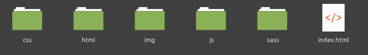

# Script Purpose
1. Create the basic structure folder for your Website.
2. This script will also create the structure for SASS [The 7-1 Pattern](https://sass-guidelin.es/#the-7-1-pattern)
> Basically, you have all your partials stuffed into 7 different folders, and a single file at the root level (usually named main.scss) which imports them all to be compiled into a CSS stylesheet.
 
## Usage

After download it on your machine, plese follow the instructions to use the Script.

<details><summary><b>Show instructions</b></summary>

1. Give the necessary permissions to run the script:

    ```
    $ chmod +x create.sh
    ```

2. Run the Script:

    ```
    $ ./create.sh
    ```

3. The Script will ask for the name of your Directory

4. .. and here we go!

</details>

### Folders Structure Tree
> The script will generate the following folder structure and open **VISUAL CODE STUDIO** at the end if you have it on your machine

 

**Inside the SASS folder the following structure will be created.**

```
sass/  
|
|– base/
|   |– _reset.scss       # Reset/normalize
|   |– _typography.scss  # Typography rules
|   ...                  # Etc…
|
|– components/
|   |– _buttons.scss     # Buttons
|   |– _carousel.scss    # Carousel
|   |– _cover.scss       # Cover
|   |– _dropdown.scss    # Dropdown
|   ...                  # Etc…
|
|– layout/
|   |– _navigation.scss  # Navigation
|   |– _grid.scss        # Grid system
|   |– _header.scss      # Header
|   |– _footer.scss      # Footer
|   |– _sidebar.scss     # Sidebar
|   |– _forms.scss       # Forms
|   ...                  # Etc…
|
|– pages/
|   |– _home.scss        # Home specific styles
|   |– _contact.scss     # Contact specific styles
|   ...                  # Etc…
|
|– themes/
|   |– _theme.scss       # Default theme
|   |– _admin.scss       # Admin theme
|   ...                  # Etc…
|
|– utils/
|   |– _variables.scss   # Sass Variables
|   |– _functions.scss   # Sass Functions
|   |– _mixins.scss      # Sass Mixins
|   |– _helpers.scss     # Class & placeholders helpers
|
|– vendors/
|   |– _bootstrap.scss   # Bootstrap
|   |– _jquery-ui.scss   # jQuery UI
|   ...                  # Etc…
|
|
`– main.scss             # Main Sass file


```
